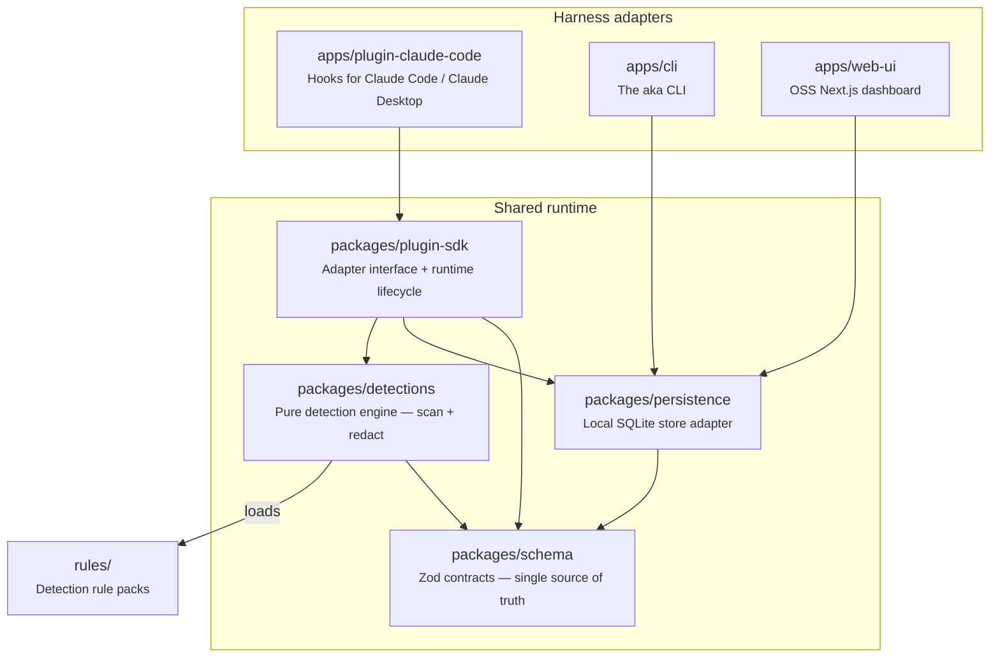

# System Overview

## Functional Architecture

At the conceptual level, AKA is a policy checkpoint between an agent harness and
the model: every prompt, tool call, and response passes through it — before the
model sees it (prompts, tool inputs) or after it responds (tool outputs) — and
each one resolves to an outcome: **Monitor**, **Warn**, **Redact**, **Block**, or
a manually-granted **Exception**. 

??? info "Related reference"
    See [How it works](../getting-started/how-it-works.md) for the traffic-flow diagram.

  

    Concept model
  

  

    <svg viewBox="0 0 380 520" role="img" aria-label="The Plugin captures an Event, which is scanned against a Rule Pack to produce a Finding, which is resolved by a Policy that results in an Action.">
      <rect class="mdx-diagram__node" x="20" y="10" width="340" height="50" rx="8" />
      <text class="mdx-diagram__node-label" x="190" y="30">Plugin</text>
      <text class="mdx-diagram__node-sub" x="190" y="48">Hooks that intercept harness sessions</text>

      <line class="mdx-diagram__arrow" x1="190" y1="60" x2="190" y2="88" marker-end="url(#concept-diagram-arrowhead)" />
      <text class="mdx-diagram__arrow-label" x="204" y="80">captures</text>

      <rect class="mdx-diagram__node" x="20" y="100" width="340" height="50" rx="8" />
      <text class="mdx-diagram__node-label" x="190" y="120">Event</text>
      <text class="mdx-diagram__node-sub" x="190" y="138">Prompt, response, or code change</text>

      <line class="mdx-diagram__arrow" x1="190" y1="150" x2="190" y2="178" marker-end="url(#concept-diagram-arrowhead)" />
      <text class="mdx-diagram__arrow-label" x="204" y="170">scanned against</text>

      <rect class="mdx-diagram__node" x="20" y="190" width="340" height="50" rx="8" />
      <text class="mdx-diagram__node-label" x="190" y="210">Rule Pack</text>
      <text class="mdx-diagram__node-sub" x="190" y="228">Rules + fixtures, by category</text>

      <line class="mdx-diagram__arrow" x1="190" y1="240" x2="190" y2="268" marker-end="url(#concept-diagram-arrowhead)" />
      <text class="mdx-diagram__arrow-label" x="204" y="260">produces</text>

      <rect class="mdx-diagram__node mdx-diagram__node--accent" x="20" y="280" width="340" height="50" rx="8" />
      <text class="mdx-diagram__node-label mdx-diagram__node-label--accent" x="190" y="300">Finding</text>
      <text class="mdx-diagram__node-sub" x="190" y="318">A rule match against an event</text>

      <line class="mdx-diagram__arrow" x1="190" y1="330" x2="190" y2="358" marker-end="url(#concept-diagram-arrowhead)" />
      <text class="mdx-diagram__arrow-label" x="204" y="350">resolved by</text>

      <rect class="mdx-diagram__node" x="20" y="370" width="340" height="50" rx="8" />
      <text class="mdx-diagram__node-label" x="190" y="390">Policy</text>
      <text class="mdx-diagram__node-sub" x="190" y="408">Maps a rule or category to an action</text>

      <line class="mdx-diagram__arrow" x1="190" y1="420" x2="190" y2="448" marker-end="url(#concept-diagram-arrowhead)" />
      <text class="mdx-diagram__arrow-label" x="204" y="440">results in</text>

      <rect class="mdx-diagram__node" x="20" y="460" width="340" height="50" rx="8" />
      <text class="mdx-diagram__node-label" x="190" y="480">Action</text>
      <text class="mdx-diagram__node-sub" x="190" y="498">Monitor, Warn, Redact, Block, or Exception</text>

      <defs>
        <marker id="concept-diagram-arrowhead" markerWidth="8" markerHeight="8" refX="0" refY="4" orient="auto">
          <path class="mdx-diagram__arrowhead" d="M0,0 L8,4 L0,8 Z" />
        </marker>
      </defs>
    </svg>
  

## Logical Architecture

At the logical level, those concepts map onto a TypeScript-strict pnpm monorepo,
split so each concept has one owning package. The three harness-facing apps
never talk to each other — they share behavior only through the runtime layer
underneath them:

`apps/cli` and `apps/web-ui` read/write `packages/persistence` directly; only
the harness plugin goes through `packages/plugin-sdk`, since that's the layer
that also owns the hook lifecycle. `packages/detections` is pure (no I/O), so the same scan/redact logic runs
identically whether it's invoked from the plugin or the enterprise backend.
`packages/plugin-sdk` is what lets a new harness adapter reuse the same runtime
instead of reimplementing storage/detection — see [Data Flow](data-flow.md) for
how a request actually moves through these packages.

---

## Where things live

| Path                            | What                                                |
| ------------------------------- | --------------------------------------------------- |
| `~/.aka/settings/settings.json` | Your preferences (run mode, redaction policy)       |
| `~/.aka/data/aka.db`            | The local SQLite store (events, findings, policies) |
| `~/.npmrc`                      | GitHub Packages scope + auth (pre-release only)     |

Everything is local. To start over, remove `~/.aka` and run `aka init` again.